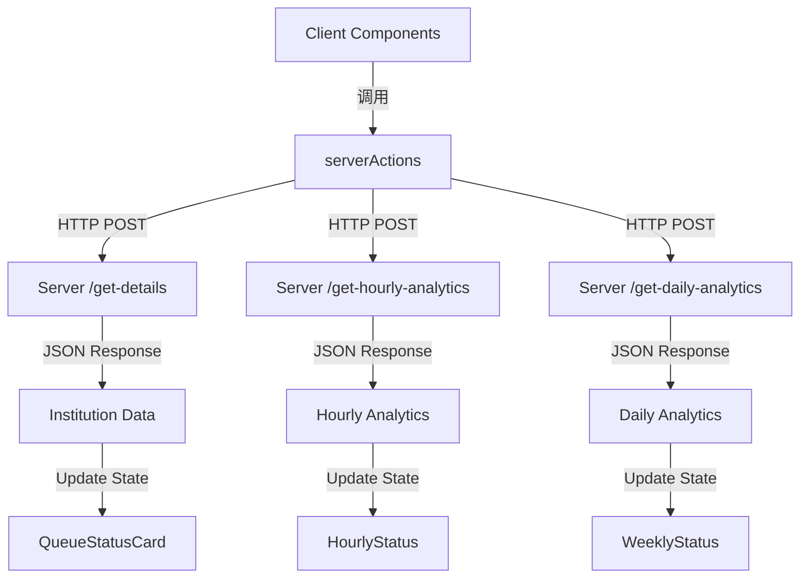

# Plan: Server Actions pentru Client

## Obiectiv
Creați un folder `serverActions` în Client/src/ care conține funcții pentru preluarea datelor de la server prin endpoint-urile existente.

---

## Arhitectura Server Actions

```
Client/src/
├── serverActions/
│   ├── apiClient.js        # Configurație și client HTTP de bază
│   ├── institutiiActions.js # Acțiuni pentru instituții
│   ├── analyticsActions.js  # Acțiuni pentru analize
│   └── keyActions.js        # Acțiuni pentru gestionarea cheilor
```

---

## Endpoint-uri Server Disponibile

| Endpoint | Metodă | Parametri | Descriere |
|----------|--------|-----------|-----------|
| `/get-details` | POST | `{ key }` | Obține detaliile instituției |
| `/save-person-count` | POST | `{ key, count }` | Salvează numărul de persoane |
| `/get-wait-time` | POST | `{ key, count }` | Obține timpul de așteptare |
| `/trigger-analytics` | POST | `{ key, type }` | Declanșează analize (hourly/daily) |
| `/get-hourly-analytics` | POST | `{ key }` | Obține analize orare |
| `/get-daily-analytics` | POST | `{ key }` | Obține analize zilnice |
| `/check-key` | POST | `{ key }` | Validează o cheie |
| `/create-key` | POST | `{ data }` | Creează o nouă cheie |

---

## Fișiere de Creat

### 1. apiClient.js
- Configurare URL server (din variabila de mediu)
- Funcții helper pentru requests (GET, POST)
- Gestionare erori
- Timeout și retry logic

### 2. institutiiActions.js
```javascript
// Funcții exportate:
- getInstitutionDetails(key)           // GET /get-details
- savePersonCount(key, count)          // POST /save-person-count
- getWaitTime(key, count)              // POST /get-wait-time
- getAllInstitutions()                  // Parsează din cheile existente
```

### 3. analyticsActions.js
```javascript
// Funcții exportate:
- getHourlyAnalytics(key)               // POST /get-hourly-analytics
- getDailyAnalytics(key)                // POST /get-daily-analytics
- triggerHourlyAnalytics(key)          // POST /trigger-analytics (type: hourly)
- triggerDailyAnalytics(key)           // POST /trigger-analytics (type: daily)
```

### 4. keyActions.js
```javascript
// Funcții exportate:
- validateKey(key)                      // POST /check-key
- createKey(data)                       // POST /create-key
```

---

## Date Necesar în Client (Dashboard)

| Component | Date Necesare | Sursă Server |
|-----------|---------------|---------------|
| QueueStatusCard | institution, desk, waitTime, status | getInstitutionDetails + getWaitTime |
| HourlyStatus | date orare (status per oră) | getHourlyAnalytics |
| WeeklyStatus | date săptămânale (status per zi) | getDailyAnalytics |

---

## Integrare cu Componente Existente

### Dashboard.jsx - Modificări:
1. Adăugare import pentru serverActions
2. Adăugare state pentru date (institution, hourlyData, weeklyData)
3. Adăugare useEffect pentru fetch la mount
4. Înlocuire valori hardcodate cu date din server

### HourlyStatus.jsx - Modificări:
1. Primește date ca prop în loc de config static
2. Mappez date de la server la formatul existent

### WeeklyStatus.jsx - Modificări:
1. Primește date ca prop în loc de config static
2. Mappez date de la server la formatul existent

---

## Diagrama Fluxului de Date



---

## Pași de Implementare

1. **Creare folder serverActions/**
2. **Creare apiClient.js** - Client HTTP de bază
3. **Creare institutiiActions.js** - Acțiuni pentru instituții
4. **Creare analyticsActions.js** - Acțiuni pentru analytics
5. **Creare keyActions.js** - Acțiuni pentru chei
6. **Actualizare Dashboard.jsx** - Integrat cu server actions
7. **Actualizare HourlyStatus.jsx** - Primește date ca props
8. **Actualizare WeeklyStatus.jsx** - Primește date ca props
9. **Testare și verificare**

---

## Notă Importantă
- Server-ul rulează pe portul 5000 (conform provider.py: `app.run(host='0.0.0.0', port=5000, debug=True)`)
- Trebuie adăugat VITE_SERVER_URL în .env pentru URL-ul serverului
- Toate request-urile sunt POST cu JSON body
- Răspunsurile sunt în format JSON
